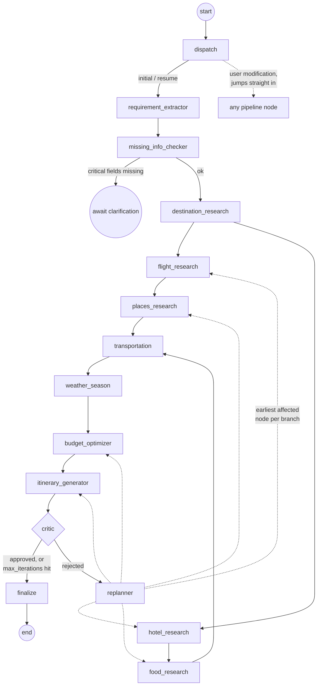

# Agent architecture

## The graph



`flight_research → places_research` and `hotel_research → food_research`
are two genuinely independent branches that LangGraph executes
concurrently — verified by inspecting event ordering during a real run
(see `docs/sample-sse-trace.md`: `flight_research`/`hotel_research`
complete back-to-back, then `food_research`/`places_research` interleave).

## State

Every node reads a subset of `TripState` (a plain, JSON-serializable
`TypedDict` — `app/agents/state.py`) and returns a partial update. Because
state persists across the whole run, node N's output *is* node N+1's
input by construction, not by convention:

```python
class TripState(TypedDict, total=False):
    requirements: dict          # written by requirement_extractor
    destination: str            # written by destination_research
    flights: list[dict]         # written by flight_research
    hotels: list[dict]
    places: list[dict]
    restaurants: list[dict]
    transportation_plan: dict
    weather: dict
    budget: dict                 # written by budget_optimizer
    itinerary: dict              # written by itinerary_generator,
                                  # consumes budget + transportation_plan + weather
    critic_result: dict          # written by critic, consumes itinerary + budget
    iteration_count: int
    ...
```

`itinerary_generator` explicitly consumes the transportation plan (arrival
transfer time/cost, not a hardcoded guess) — this was a real gap caught
during testing (see the note in `app/ai/mock_llm.py::generate_itinerary`)
and is exactly the kind of thing that's easy to get wrong when wiring a
multi-stage pipeline: a node existing and a node's *output actually being
read downstream* are two different claims, and only tests catch the gap
between them.

## The critic

`critic_review` (real-LLM path: `app/ai/orchestrator.py`; deterministic
fallback: `app/ai/mock_llm.py`) checks the assembled itinerary against:

- Budget (does the optimized total still exceed the traveler's budget)
- Underutilized days (a non-edge day with zero attractions)
- Duplicate attractions across the itinerary
- Overpacked days relative to the traveler's stated pace
- Violated dislikes (e.g. a high-crowd attraction when the traveler said
  they dislike crowds)

Each issue carries a `recommended_searches` list naming which pipeline
nodes should rerun. `replanner` doesn't blindly restart from scratch —
it computes the earliest node *per affected branch* that needs to run
again (see `compute_replan_targets` in `app/agents/state.py`) and jumps
straight there, so already-correct research (e.g. flights, when only the
hotel/budget side has a problem) is never redone.

## A real example of the loop

Captured from an actual test run (₹1,50,000 budget, 8 days, 2 travelers —
genuinely tight for Japan):

```
[critic_result] Found 1 issue(s): Itinerary is over budget by 33395 INR
                 even after optimization.
[replanning]     Re-running from ['flight_research', 'hotel_research']...
[critic_result] Found 2 issue(s): Itinerary is over budget by 37525 INR...;
                 Itinerary includes a high-crowd attraction despite the
                 traveler disliking crowds.
[replanning]     Re-running from ['places_research', 'hotel_research']...
[critic_result] Found 2 issue(s): ...unresolved
[completed]      Reached the 3-iteration limit with unresolved issues
                 (severity: high); delivering the best itinerary produced
                 so far rather than looping indefinitely.
```

Note two things this demonstrates:

1. **Real trade-offs, honestly reported.** Fixing the budget by trying
   cheaper flights and hotels didn't fully close the gap; separately,
   fixing an "underutilized day" issue by widening the places search
   pulled in a high-crowd attraction the traveler said they disliked. The
   system tried the standard optimization ladder (cheaper hotel tier →
   cheaper flights → trim activities → trim shopping/buffer) and, when
   that genuinely wasn't enough, **said so** instead of quietly marking
   the trip approved. `MAX_AGENT_ITERATIONS` (default 3) exists exactly
   for this: bound the loop, then deliver the best attempt with the
   unresolved issues visible in `critic_notes`.
2. **`flight_research`/`hotel_research` reruns together as a matched
   pair, not separately at different depths.** This is the fix for a real
   LangGraph bug this project hit: if two parallel branches are targeted
   in the *same* replan but at different depths from their join node, the
   join fires twice and everything downstream double-executes. See
   `compute_replan_targets`'s docstring and
   `backend/tests/test_graph_topology.py` for the isolated repro and fix.

A satisfiable budget (₹3,50,000 for the same trip) converges to
`approved=True` after a single pass — both paths are exercised in
`backend/tests/test_graph_end_to_end.py`.

## Conversational modification

`POST /trips/{id}/modify` doesn't run through the graph's normal entry —
`TripService.modify_trip` first calls
`LLMOrchestrator.interpret_modification(message, current_requirements)`,
which returns which requirement fields changed and which nodes need to
rerun. That target list goes through the same `compute_replan_targets`
the critic loop uses, then the graph is invoked with `trigger="modification"`
and `replan_target` already set — `dispatch` (the graph's actual entry
node) sees that and jumps straight to the right node(s), skipping
`requirement_extractor` entirely. Verified in
`backend/tests/test_api_trips.py::test_modify_creates_new_itinerary_version_without_rerunning_flights` —
after "Hotels are too expensive," the flight-options row count in Postgres
is unchanged.

## Cost tracking

`LLMOrchestrator._structured()` requests `include_raw=True` from
LangChain's `with_structured_output`, which surfaces `usage_metadata` on
the raw response — input/output token counts feed a rough per-1K-token
cost estimate, accumulated across the whole run via an `operator.add`
state reducer (see below) and returned to the client as
`agent_runs.estimated_cost_usd`. In demo mode this is always zero and
honestly labeled as such (`used_mock: true`) — no LLM call happened, so
there's nothing to bill.

## A LangGraph subtlety worth knowing if you extend this graph

State keys that multiple *concurrently executing* nodes might write in
the same superstep (here: `tool_call_count`, `input_tokens`,
`output_tokens`, `estimated_cost_usd` — every node touches these) need an
explicit reducer (`Annotated[int, operator.add]`), and the nodes must
return **deltas**, not running totals read from their input state.
Without this, LangGraph rejects the concurrent write outright ("already
being used as a state key" / channel conflict errors) — this was caught
by literally running the graph with two parallel branches active, not by
reading documentation.
