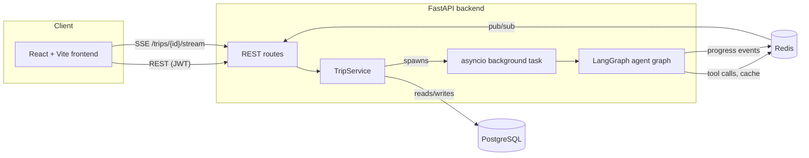

# Architecture

## System overview

## Request flow

1. `POST /api/trips` creates a `Trip` row (`status=draft`) with the user's
   raw prompt. Fast, synchronous.
2. `POST /api/trips/{id}/plan` flips the trip to `planning` and returns
   `202 Accepted` immediately — the actual graph run happens in a
   background asyncio task (see below), not inline in the request. This
   matters: if planning ran synchronously inside the request handler, the
   frontend could never observe live progress, because by the time it got
   a response and opened the SSE connection, everything would already have
   happened.
3. The frontend opens `GET /api/trips/{id}/stream` (SSE) and polls
   `GET /api/trips/{id}/status` as a fallback/completion signal.
4. Every agent node calls a shared `emit()` helper
   (`app/services/progress.py`) at key points. Each call does two things:
   writes an `AgentEvent` row (durable history, replayable via
   `GET /agent-runs/{id}`) and publishes the same payload to a Redis
   pub/sub channel keyed by trip ID, which the SSE endpoint subscribes to.
5. When the graph run finishes (approved, or the iteration cap is hit),
   `TripService._sync_state_to_db` writes the final `TripState` into
   normalized Postgres tables (drops and recreates the regenerable
   research/itinerary rows — trips are small enough that this is simpler
   and safer than diffing) and stores the *raw* state as JSONB on the
   `Trip` row itself, so a later request (answering a clarifying question,
   or a "make it cheaper" modification) can reconstruct exactly where the
   run left off.

## Background execution

The spec calls for Celery "or an equivalent background-job system." This
build uses **asyncio background tasks + Redis pub/sub** instead of a
literal Celery worker:

- `asyncio.create_task()` runs the planning coroutine outside the request/
  response cycle, in the same process.
- Progress and completion are observable the same way they'd be with a
  real worker — via Redis pub/sub (live) and Postgres (durable).

This was a deliberate simplification, not an oversight: a real Celery
deployment needs a broker, a result backend, and worker process
management, which is real operational complexity for a single-container
demo app. The trade-off is horizontal scalability — an asyncio task is
pinned to the process that created it, where a real Celery worker pool
would let you scale planning throughput independently of the API. If you
outgrow one process, `app/services/trip_service.py`'s `TripService` is
already the seam: wrap `plan_existing_trip` / `modify_trip` /
`regenerate_trip` in Celery tasks, publish progress the same way, and swap
the route handlers' `asyncio.create_task(...)` calls for `.delay(...)`.

## Where LangGraph's checkpointer is (and isn't) used

The compiled graph uses `MemorySaver` — in-process checkpointing that
lets LangGraph's own execution model work correctly (superstep
scheduling, fan-out/fan-in) *within* a single `ainvoke()` call. It is
**not** relied on for cross-request resumption. That responsibility is
explicit and in application code instead: `Trip.state_snapshot` (a JSONB
column) holds the last full `TripState`, and every new planning
invocation — resuming after a clarifying question, or a user-driven
partial replan — reconstructs its starting state from that column before
calling the graph again. This was a deliberate choice for
predictability: cross-process checkpointer persistence has its own
subtleties (serialization, thread-ID semantics across restarts), and
since the app already needs normalized Postgres tables for querying,
keeping *one* source of truth for "what does this trip's plan currently
look like" was simpler to reason about and test than depending on two.

## Caching

Every tool-provider call (flights, hotels, places, weather) goes through
`app/tools/cache.py`, a thin Redis-backed cache keyed by a hash of the
call's arguments, with per-category TTLs from `.env`. This was verified
against a real local Redis instance during development (see
`backend/tests/test_tools.py::TestCache`).
