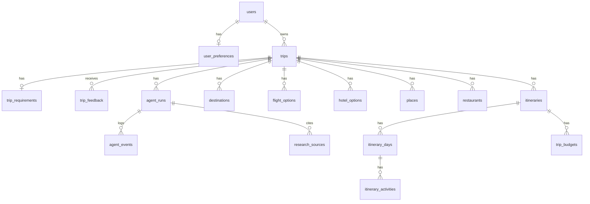

# Database

PostgreSQL, SQLAlchemy 2 (async, `asyncpg`), Alembic migrations. 17 tables,
normalized — free-text preference lists (likes/dislikes/must-see) use
JSONB columns where the shape is genuinely variable, not as a substitute
for real columns everywhere.



## Notable design choices

- **`trips.state_snapshot` (JSONB)** — the full last-known LangGraph
  `TripState`. This is how a later request (resuming after a clarifying
  question, or a partial replan) reconstructs where the last run left
  off, without depending on the in-process graph checkpointer surviving
  across requests. See `docs/architecture.md`.
- **Itineraries are versioned, not overwritten.** Every successful
  generation (initial plan, modification, full regenerate) inserts a new
  `itineraries` row with an incremented `version`; the API always serves
  the latest. This preserves history without needing a separate
  `trip_feedback`-style audit table for itinerary changes specifically.
- **`agent_events`** is a single normalized log table for everything the
  spec's `agent_messages` / `agent_tool_calls` / `agent_iterations` would
  otherwise split into three — `event_type` (`agent_started`,
  `tool_completed`, `critic_result`, `replanning`, ...) plus a JSONB
  `payload` covers all three without three near-identical tables.
- **`is_mock` flags** on every research-result table (`flight_options`,
  `hotel_options`, `places`, `destinations`, `restaurants`) — demo data is
  labeled at the row level, not just in the UI, so it survives being
  queried directly.

## Migrations

```bash
cd backend
alembic upgrade head        # apply
alembic downgrade base      # roll back everything (tested — see below)
alembic revision --autogenerate -m "describe your change"
```

The initial migration was generated against a real clean database and
verified both directions: `upgrade head` produces all 17 tables with the
expected columns/constraints, `downgrade base` cleanly drops all of them.
